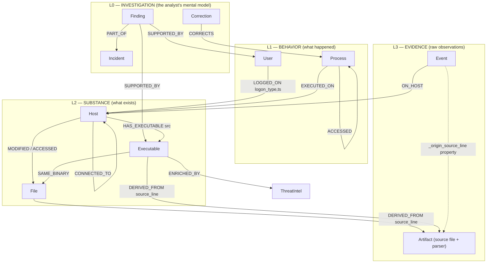

# Architecture

## System Overview

graphir is a Model Context Protocol (MCP) server that bridges Claude Code to a Neo4j investigation graph. The architecture enforces constraints at the type system level — not via prompts.

```
┌──────────────────────────────────────────────────────────────────┐
│                         Claude Code                               │
│                    (Autonomous IR Analyst)                         │
│                                                                    │
│  Receives natural language query ("find evil", "who did this?")    │
│  Selects and sequences tools autonomously                          │
│  Reasons about findings, decides next investigation steps          │
│  Self-corrects via dual-path verification                          │
│  Produces structured investigation report                          │
├────────────────────────────┬─────────────────────────────────────┤
│                            │                                       │
│                    MCP Protocol (stdio)                             │
│                    JSON-RPC, typed tools                            │
│                    No shell access                                  │
│                            │                                       │
│   ┌────────────────────────▼─────────────────────────────────┐     │
│   │              graphir MCP Server (Python)                  │     │
│   │                                                            │     │
│   │  ┌─────────────┐  ┌──────────────┐  ┌────────────────┐   │     │
│   │  │ Investigation│  │  Ingestion    │  │  Verification  │   │     │
│   │  │              │  │              │  │                │   │     │
│   │  │ query_graph  │  │ ingest_      │  │ verify_finding │   │     │
│   │  │ find_evil    │  │  timeline    │  │ trace_origin   │   │     │
│   │  │ shortest_path│  │              │  │ check_         │   │     │
│   │  │ entity_      │  │ Plaso JSONL  │  │  provenance_   │   │     │
│   │  │  neighborhood│  │  → Graph     │  │  integrity     │   │     │
│   │  │ temporal_    │  │              │  │                │   │     │
│   │  │  chain       │  │ Origin       │  │ Atomic claims  │   │     │
│   │  │ graph_stats  │  │ propagation  │  │ Dual-path      │   │     │
│   │  │              │  │ on every     │  │ verification   │   │     │
│   │  │              │  │ entity       │  │                │   │     │
│   │  └──────┬───────┘  └──────┬───────┘  └───────┬────────┘   │     │
│   │         │                 │                   │            │     │
│   │         └────────────┬────┘───────────────────┘            │     │
│   │                      │                                      │     │
│   │              Parameterised Cypher                           │     │
│   │              (no string interpolation)                      │     │
│   │                      │                                      │     │
│   └──────────────────────┼──────────────────────────────────────┘     │
│                          │                                             │
│                   Bolt Protocol                                        │
│                          │                                             │
│   ┌──────────────────────▼──────────────────────────────────────┐     │
│   │                Neo4j 5 Community                              │     │
│   │                graphir-neo4j (Docker)                          │     │
│   │                                                                │     │
│   │  Graph Schema (13 vertex types, 15 edge types):                │     │
│   │                                                                │     │
│   │  (Process)──SPAWNED──>(Process)──ACCESSED──>(Process)          │     │
│   │    │                    │                     lsass.exe         │     │
│   │  EXECUTED_ON          ACCESSED                                  │     │
│   │    │                    │                                       │     │
│   │    ▼                    ▼                                       │     │
│   │  (Host)──────────────(File)                                    │     │
│   │    │         │                                                  │     │
│   │    │    HAS_EXECUTABLE                                          │     │
│   │    │         │                                                  │     │
│   │    │         ▼                                                  │     │
│   │  LOGGED_ON  (Executable) ← prefetch/amcache/shimcache          │     │
│   │    │         (per-binary, not per-instance)                     │     │
│   │    ▼                                                            │     │
│   │  (User)──LOGGED_ON──>(Host)──CONNECTED_TO──>(Host)             │     │
│   │                                                                │     │
│   │  (Correction)──CORRECTS──>(any entity)                         │     │
│   │                                                                │     │
│   │  Every entity carries _origin_* metadata                       │     │
│   │  Constraints: Host.hostname, User.sid, Executable.path UNIQUE  │     │
│   │  Indexes: Process(name), Process(pid,ts), File(path),          │     │
│   │           Executable(path), Correction(id), all temporal edges │     │
│   └────────────────────────────────────────────────────────────────┘     │
└──────────────────────────────────────────────────────────────────────────┘
```

## Graph Schema — Visual

The schema is fractal: the same shape repeats at every zoom level — nodes,
relationships between them, and provenance edges pointing one level down.
An investigator should be able to zoom from the incident narrative to the
raw artifact line without leaving the graph.



### Live coverage vs declared schema

Not every declared element exists in every investigation — and the gaps split
into two honest categories:

| Element | Status | Why |
|---------|--------|-----|
| Event→Host (`ON_HOST`) | live, ~737K (SANS 508) | every event |
| Host→File (`MODIFIED`/`ACCESSED`) | live, ~543K | fs:stat MACB |
| User→Host (`LOGGED_ON`) | live, ~190K | 4624/4625 |
| Host→Host (`CONNECTED_TO`) | live, ~48K | logon src_ip resolution |
| Host→Executable (`HAS_EXECUTABLE`) | live, ~1.7K | prefetch/amcache/shimcache |
| Executable→File (`SAME_BINARY`) | built post-ingest | links binary identity to filesystem instance (MACB) |
| entity→Artifact (`DERIVED_FROM`) | built post-ingest, ~94K | provenance to source file + line (Events keep `_origin_*` props) |
| Process / `SPAWNED` / `EXECUTED_ON` | **dataset-dependent** | requires 4688/Sysmon; default Win7/XP audit policy doesn't log process creation |
| `Connection` vertex | **declared, not implemented** | network flow ingestion is roadmap; CONNECTED_TO is Host→Host today |
| `ThreatIntel` / `ENRICHED_BY` | conditional | only after VT enrichment runs |
| `Finding` / `SUPPORTED_BY` | materialized by reconstruct_attack | completes the L0 layer |

A predicate that depends on a dataset-dependent layer (e.g. `spawned_edge_exists`
on a host without 4688 auditing) will return ABSENT_DATA — this is the
"absence is ambiguous" limitation in VERIFICATION.md, visible at schema level.

## Trust Boundaries

### Boundary 1: Claude Code ↔ MCP Server

- **Interface:** MCP protocol over stdio (JSON-RPC)
- **Constraint:** Claude Code can ONLY call typed MCP tools with defined input schemas. It cannot execute arbitrary shell commands against the evidence or the graph.
- **Why this matters:** A prompt-based guardrail ("don't run rm") can be overridden by sufficiently creative prompting. A typed interface cannot — the tool either exists or it doesn't.

### Boundary 2: MCP Server ↔ Neo4j

- **Interface:** Bolt protocol with parameterised Cypher
- **Constraint:** All Cypher queries use `$parameters`, never string interpolation. This prevents Cypher injection the same way parameterised SQL prevents SQL injection.
- **Why this matters:** The `query_graph` tool accepts arbitrary Cypher from the agent. Parameterisation ensures the agent's queries are syntactically constrained even when semantically open-ended.

### Boundary 3: MCP Server ↔ SIFT Tools

- **Interface:** Subprocess calls with validated arguments
- **Constraint:** Each SIFT tool wrapper validates its input (file paths must exist, no path traversal, no shell metacharacters)
- **Why this matters:** The MCP server mediates all access to forensic tools. The agent cannot bypass the wrapper to run arbitrary commands.

## Data Flow

```
Forensic Image (.E01, .dd, .raw)
    │
    ▼
log2timeline (Plaso) ──── runs on SIFT Workstation
    │
    ▼
timeline.jsonl (Plaso JSON-L output)
    │
    ▼
ingest_timeline (MCP tool)
    │
    ├── Parse each JSON line
    ├── Route by data_type (evtx, prefetch, amcache, shimcache, ...)
    ├── Create vertices: Host, User, Process, Executable, File, Connection, Event
    ├── Process nodes = per-instance (CREATE), Executable nodes = per-binary (MERGE)
    ├── Create edges: EXECUTED_ON, SPAWNED, ACCESSED, CONNECTED_TO, LOGGED_ON,
    │                  MODIFIED, HAS_EXECUTABLE, ON_HOST
    ├── Attach _origin_* metadata to every entity
    ├── Parent process stubs marked _origin_tool='inferred_parent' (honest derivation)
    │
    ▼
Neo4j Investigation Graph
    │
    ├── find_evil() ─── hunt patterns (22 structural queries)
    ├── query_graph() ── ad-hoc Cypher from agent reasoning
    ├── shortest_path() ── attack chain tracing
    ├── temporal_chain() ── time-windowed activity
    │
    ▼
Findings (with dual-path verification)
    │
    ├── verify_finding() ── atomic claim decomposition + structural predicates
    ├── trace_origin() ──── walk entity back to raw artifact
    │
    ▼
Investigation Output Package
    ├── Executive summary (PDF)
    ├── Technical report (PDF)
    ├── Attack chain (SVG)
    ├── Timeline (SVG)
    ├── ATT&CK Navigator layer (JSON)
    ├── Sigma rules (YAML, vendor-neutral)
    ├── Recommendations (operational / tactical / strategic)
    └── Evidence chain (JSON, full provenance)
```

## Why Graph, Not Flat Logs

Traditional IR tools process events as flat rows. The analyst manually pivots between them, holding the investigation model in their head. This does not scale.

A graph database externalises the analyst's mental model:
- **Relationships ARE the investigation.** "Process A spawned Process B" is a traversable edge, not a text string to grep for.
- **Shortest path = attack chain.** "How did the attacker get from the phishing email to the domain controller?" is a single graph query, not hours of manual log correlation.
- **Self-correction is structural.** "I claimed lateral movement but there's no auth edge between Host A and Host B" is a falsifiable graph query. The agent doesn't re-read text — it checks structure.

The AI agent doesn't search for indicators. It traverses attack paths.

## Key Design Decisions

### Process vs Executable (the Identity Crisis fix)

Early versions used `MERGE (p:Process {name: 'svchost.exe'})` for both 4688 process
creation events AND prefetch/amcache/shimcache artifacts. This created a "God-Node"
problem: 10,000 execution instances of svchost.exe collapsed into one node that all
execution evidence connected to. The forensic link between a specific execution event
and the artifact was completely severed.

**Solution:** Two separate node types.
- `Process` — per-instance, created with `CREATE`. Every 4688 event = new node.
- `Executable` — per-binary, created with `MERGE` on path. One node per binary file.
  Prefetch, amcache, shimcache connect here via `HAS_EXECUTABLE` edges.

### Super-Node Exclusion in Path Traversal

The Host node is a super-node: every Process connects via EXECUTED_ON, every Event
via ON_HOST. If `shortestPath` traverses these edges, the shortest path between any
two entities is always 2 hops through the Host hub — useless for attack chain tracing.

**Solution:** `shortest_path` tool defaults to `attack_path_only=True`, traversing
only `[:SPAWNED|ACCESSED|MODIFIED|CONNECTED_TO|LOGGED_ON]`. The Host hub is excluded
from traversal unless explicitly requested.

### Bounded Temporal Windows

Temporal predicates in verification use bounded windows (e.g., 24h) instead of
unbounded comparisons. A service install in 2026 should not be linked to a logon
from 2021 just because the logon came first.

### Honest Provenance for Inferred Entities

When a Process node is created as a parent stub (the parent wasn't directly observed
in logs), it is marked with `_origin_tool='inferred_parent'` and
`_origin_derived_from_child_line` instead of falsely claiming the child's source line.
Auditors see the derivation chain, not a false origin.

### Read-Only Query Enforcement

`query_graph` (the tool the LLM uses for ad-hoc Cypher) enforces read-only at the
application layer — CREATE, DELETE, MERGE, SET, REMOVE, DROP are rejected. This
prevents the LLM from accidentally or maliciously modifying the investigation graph.
Neo4j Community lacks RBAC, so this is enforced in Python.

## Technology Choices

| Component | Choice | Reason |
|-----------|--------|--------|
| Graph DB | Neo4j 5 Community | Best Cypher support, APOC library, free, Docker-friendly |
| MCP framework | FastMCP (Python) | Official MCP SDK, typed tool definitions, stdio transport |
| LLM | Claude Code (Anthropic) | Hackathon partner, strong reasoning, native MCP support |
| Ingestion format | Plaso JSON-L | Standard output from SIFT Workstation's log2timeline |
| Container | Docker Compose | One-command setup |
| Language | Python 3.11+ | Ecosystem: neo4j driver, MCP SDK, Plaso compatibility |
